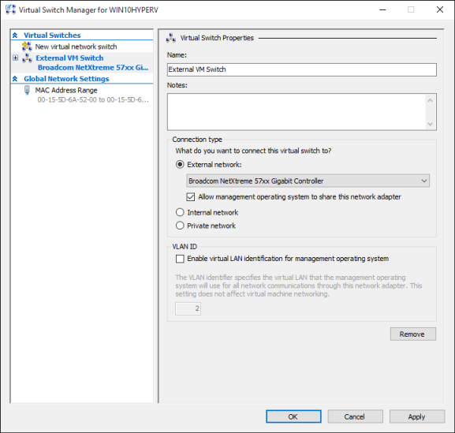
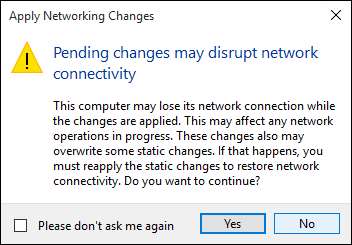

# Create a virtual network

Your virtual machines will need a virtual network to share a network with your computer.  Creating a virtual network is optional -- if your virtual machine doesn't need to be connected to the internet or a network, skip ahead to [creating a Windows Virtual Machine](create-virtual-machine.md).


## Connect virtual machines to the internet

Hyper-V has three types of virtual switches -- external, internal, and private. create an external switch to share your computer's network with the virtual machines running on it.

This exercise walks through creating an external virtual switch. Once completed, your Hyper-V host will have a virtual switch that can  connect virtual machines to the internet through your computer's network connection. 

### Create a Virtual Switch with Hyper-V Manager

1. Open Hyper-V Manager.  A quick way to do this is by hitting the Windows button or key then type "Hyper-V Manager".  
If search doesn't find Hyper-V Manager, Hyper-V or the Hyper-V management tools are not enabled.  See the instructions to [enable Hyper-V](enable-hyper-v.md).

2. In Hyper-V Manager, select **Virtual Switch Manager...** from the 'Actions' menu on the right.

3. Under the 'Virtual Switches' section, select **New virtual network switch**.

4. Under 'What type of virtual switch do you want to create?', select **External**.

5. Select the **Create Virtual Switch** button.

6. Under ‘Virtual Switch Properties’, give the new switch a name such as **External VM Switch**.

7. Under ‘Connection Type’, ensure that **External Network** has been selected.

8. Select the physical network card to be paired with the new virtual switch. This is the network card that is physically connected to the network.  

	

9. Select **Apply** to create the virtual switch. At this point you will most likely see the following message. Click **Yes** to continue.

	  

10. Select **OK** to close the Virtual Switch Manager Window.


### Create a Virtual Switch with PowerShell

The following steps can be used to create a virtual switch with an external connection using PowerShell. 

1. Use **Get-NetAdapter** to return a list of network adapters connected to the Windows 10 system.

	```powershell
	PS C:\> Get-NetAdapter

	Name                      InterfaceDescription                    ifIndex Status       MacAddress             LinkSpeed
	----                      --------------------                    ------- ------       ----------             ---------
	Ethernet 2                Broadcom NetXtreme 57xx Gigabit Cont...       5 Up           BC-30-5B-A8-C1-7F         1 Gbps
	Ethernet                  Intel(R) PRO/100 M Desktop Adapter            3 Up           00-0E-0C-A8-DC-31        10 Mbps  
	```

2. Select the network adapter to use with the Hyper-V switch and place an instance in a variable named **$net**.

	```
	$net = Get-NetAdapter -Name 'Ethernet'
	```

3. Execute the following command to create the new Hyper-V virtual switch.

	```
	New-VMSwitch -Name "External VM Switch" -AllowManagementOS $True -NetAdapterName $net.Name
	```

## Virtual networking on a laptop

### NAT networking
Network Address Translation (NAT) gives a virtual machine access to your computer's network by combining the host computer's IP address with a port through an internal Hyper-V Virtual Switch.

This has a few useful properties:
1. NAT Conserves IP addresses by mapping an external IP address and port to a much larger set of internal IP addresses. 
2. NAT allows multiple virtual machines to host applications that require identical (internal) communication ports by mapping these to unique external ports.
3. NAT uses an internal switch -- creating an internal switch doesn't cause you to use network connection and tends to interfere less with a computer's networking.

To set up a NAT network and connect it to a virtual machine, follow the [NAT networking user guide](../user-guide/setup-nat-network.md).

### The two switch approach
If you're running Windows 10 Hyper-V on a laptop and frequently switch between wireless networking and a wired network, you may want to create a virtual switch for both the Ethernet and wireless network cards. With this configuration, you can change your virtual machines between these switches depending on how the laptop is connected to the network. Virtual machines will not automatically switch between wired and wireless.


## Next Step - Create a Virtual Machine
[Create a Windows Virtual Machine](create-virtual-machine.md)
